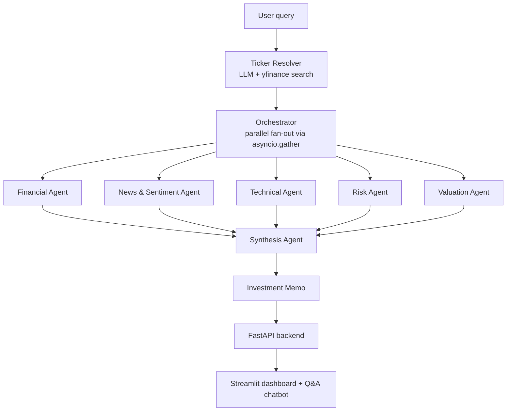

# AlphaLens — Multi-Agent AI Stock Researcher

Turns a plain-language query ("Tesla", "is NVDA a buy?") into a full equity research memo — recommendation, conviction, price target, and thesis — by running five specialist AI agents in parallel and synthesizing their findings into one structured report.

**Live demo:** https://alphalens-multiaiagentstockresearcher.streamlit.app/ *(free-tier hosting, so the first load can take ~30s to wake up)*

## How it works



Each specialist is its own LangGraph subgraph, run concurrently:

| Agent | Approach | Produces |
|---|---|---|
| Financial | Tool-calling loop over yfinance | Income statement, balance sheet, cash flow, key ratios |
| News & Sentiment | Tool-calling loop over yfinance news, ROIC.ai earnings calls, insider trades | Sentiment read, earnings-surprise history |
| Technical | Deterministic `pandas-ta` pipeline | Trend, momentum, volume, and volatility signals |
| Risk | Deterministic quant pipeline | Liquidity/business/financial/market risk, beta, VaR, max drawdown |
| Valuation | Tool-calling loop + blended model | DCF, comps, and Graham Number, confidence-weighted into one price target |

A **Synthesis agent** reconciles all five reports into a single Pydantic-validated `InvestmentMemo` — recommendation, conviction, ranked risks, conflicting signals, and data gaps — explicitly flagging where agents disagree or failed rather than smoothing that over.

## Features

- Natural-language company lookup with a disambiguation step when a name matches multiple tickers
- Fully async, parallel agent execution with per-agent error isolation — one agent failing doesn't sink the run
- Structured outputs enforced end-to-end via Pydantic, for every agent and the final memo
- Interactive dashboard: valuation chart, confidence gauge, ranked risks, conflicting-signals callout
- Follow-up chatbot grounded on the generated memo, so users can ask "why" without re-running the pipeline

## Tech stack

- **Agents/Orchestration:** LangGraph, LangChain
- **LLMs (via Groq):** Llama 4 Scout (tool-calling), Llama 3.3 70B (report writing), GPT-OSS-120B (synthesis + chat)
- **Data:** yfinance, pandas-ta, ROIC.ai, NumPy
- **Backend:** FastAPI, Pydantic, Docker + uv — deployed on Render
- **Frontend:** Streamlit, Plotly — deployed on Streamlit Community Cloud

## Project structure

```
├── src/
│   ├── AlphaLens/
│   │   ├── Orchestrator/     # fans out to sub-agents, merges results
│   │   ├── SubAgent/         # Financial, Sentiment, Technical, Risk, Valuation agents
│   │   ├── Synthesis/        # combines all reports into the final memo
│   │   └── graph/            # top-level LangGraph workflow
│   └── Query_Extraction/     # resolves a free-text query into a ticker
├── Backend/api.py            # FastAPI endpoints
├── Frontend/                 # Streamlit dashboard + memo-grounded chatbot
└── Tests/                    # per-agent smoke scripts + dev notebooks
```

## Getting started

```bash
git clone https://github.com/RoronoaZoro450/AlphaLens-Multi_AI_Agent_Stock_Researcher.git
cd AlphaLens-Multi_AI_Agent_Stock_Researcher
uv sync                      # or: pip install -r requirements.txt
```

Create a `.env` file:
```
GROQ_API_KEY=your_key        # required — powers every agent, free at console.groq.com
ROC_AI_API_KEY=your_key      # optional — earnings-call data; agent degrades gracefully without it
```

Run it:
```bash
# Backend API
uv run uvicorn Backend.api:app --reload

# Frontend, in a separate terminal
uv run streamlit run Frontend/app.py

# Or skip the UI and run the pipeline straight from the CLI
uv run python main.py
```

## Limitations

- Agent tests are manual smoke scripts run against a hardcoded ticker, not an automated CI suite
- No caching layer — every query re-fetches live data and re-runs all five agents from scratch
- Data quality is bounded by yfinance's free-tier fields, which can be sparse for smaller-cap or non-US tickers
