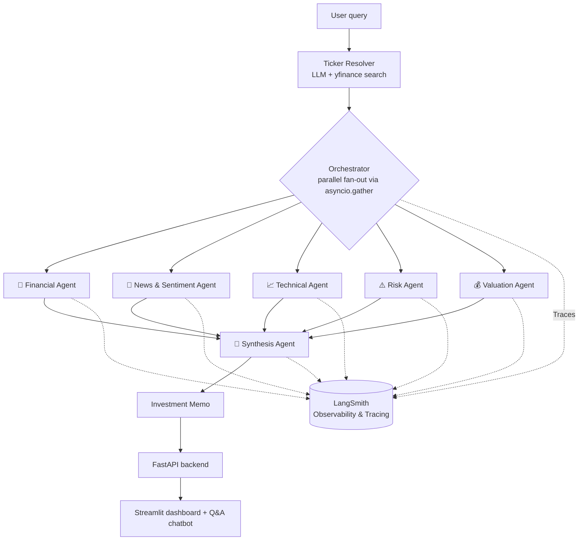

<div align="center">
  <h1>📈 AlphaLens</h1>
  <h3>The Multi-Agent AI Stock Researcher</h3>
  
  <p>
    <a href="#-demo"><strong>🎥 Watch the Demo</strong></a> • 
    <a href="#-getting-started"><strong>🚀 Getting Started</strong></a> • 
    <a href="#%EF%B8%8F-how-it-works"><strong>🧠 Architecture</strong></a>
  </p>

  <p>
    
    
    
    
    
    
  </p>
</div>

<br/>

> A simple Stock Search turns into a **full equity research memo** — complete with recommendation, conviction, price target, and thesis — by running **five specialist AI agents in parallel** and synthesizing their findings into one structured report.

---

## 🎥 Demo

<div align="center">

<!--
  Replace this with your actual demo video or GIF.
  Easiest option: open this file in GitHub's web editor and drag your
  video/GIF directly into this section — GitHub auto-generates an
  embeddable link like https://github.com/user-attachments/assets/...

  Hosting on YouTube or Loom instead? Use a clickable thumbnail:
  [](https://youtu.be/your-video-id)
-->

*🎬 Full walkthrough video coming soon*

</div>

> **Note:** This project isn't hosted publicly right now — the video above shows a full run end-to-end. To try it yourself, follow [Getting Started](#-getting-started) below.

---

## ⚙️ How It Works

Behind the scenes, AlphaLens leverages a fully asynchronous orchestration layer that spins up five distinct LangGraph agents. Each agent assumes a highly specialized role to evaluate the stock from a unique angle.



Each specialist operates as its own **LangGraph subgraph**, running concurrently:

| Agent | Approach | Produces |
| :--- | :--- | :--- |
| **🏦 Financial** | Tool-calling loop over `yfinance` | Income statement, balance sheet, cash flow, key ratios |
| **📰 News & Sentiment** | Tool-calling loop over `yfinance` news, `ROIC.ai` earnings calls, insider trades | Sentiment read, earnings-surprise history |
| **📈 Technical** | Deterministic `pandas-ta` pipeline | Trend, momentum, volume, and volatility signals |
| **⚠️ Risk** | Deterministic quant pipeline | Liquidity/business/financial/market risk, beta, VaR, max drawdown |
| **💰 Valuation** | Tool-calling loop + blended model | DCF, comps, and Graham Number, confidence-weighted into one price target |

A **Synthesis agent** reconciles all five reports into a single Pydantic-validated `InvestmentMemo`. It extracts the recommendation, conviction, ranked risks, conflicting signals, and data gaps — explicitly flagging where agents disagree or failed rather than smoothing that over.

---

## ✨ Features

- **🗣️ Natural-Language Company Lookup:** Includes a disambiguation step when a name matches multiple tickers.
- **⚡ Fully Async Parallel Execution:** Per-agent error isolation ensures that one agent failing doesn't sink the entire run.
- **🛡️ Structured Outputs:** Enforced end-to-end via Pydantic for every agent and the final memo.
- **🔍 Comprehensive Observability:** Integrated with **LangSmith** to trace agent executions, debug LLM prompts, and monitor pipeline performance.
- **📊 Interactive Dashboard:** Features a valuation chart, confidence gauge, ranked risks, and a conflicting-signals callout.
- **💬 Memo-Grounded Chatbot:** A follow-up Q&A bot grounded entirely on the generated memo, allowing users to ask "why" without re-running the pipeline.

---

## 🛠️ Tech Stack

- **Orchestration & Agents:** LangGraph, LangChain
- **Observability:** LangSmith
- **LLMs (via Groq):** 
  - `Llama 4 Scout` *(tool-calling)*
  - `Llama 3.3 70B` *(report writing)*
  - `GPT-OSS-120B` *(synthesis + chat)*
- **Data:** `yfinance`, `pandas-ta`, `ROIC.ai`, NumPy
- **Backend:** FastAPI, Pydantic, Docker + `uv`
- **Frontend:** Streamlit, Plotly

---

## 📁 Project Structure

```text
├── src/
│   ├── AlphaLens/
│   │   ├── Orchestrator/     # Fans out to sub-agents, merges results
│   │   ├── SubAgent/         # Financial, Sentiment, Technical, Risk, Valuation
│   │   ├── Synthesis/        # Combines all reports into the final memo
│   │   └── graph/            # Top-level LangGraph workflow
│   └── Query_Extraction/     # Resolves a free-text query into a ticker
├── Backend/api.py            # FastAPI endpoints
├── Frontend/                 # Streamlit dashboard + memo-grounded chatbot
└── Tests/                    # Per-agent smoke scripts + dev notebooks
```

---

## 🚀 Getting Started

### 1. Clone the Repository
```bash
git clone https://github.com/RoronoaZoro450/AlphaLens-Multi_AI_Agent_Stock_Researcher.git
cd AlphaLens-Multi_AI_Agent_Stock_Researcher
```

### 2. Install Dependencies
Using [`uv`](https://github.com/astral-sh/uv) is recommended for speed:
```bash
uv sync                      
# or: pip install -r requirements.txt
```

### 3. Environment Variables
Create a `.env` file in the root directory:
```env
# Required — powers every agent, free at console.groq.com
GROQ_API_KEY=your_key

# Optional — earnings-call data; agent degrades gracefully without it
ROC_AI_API_KEY=your_key

# Optional — LangSmith Observability
LANGCHAIN_TRACING_V2=true
LANGCHAIN_API_KEY=your_key     # free at smith.langchain.com
LANGCHAIN_PROJECT=AlphaLens
```

### 4. Run the Application
Start the backend API and the frontend dashboard in separate terminals.

**Terminal 1 (Backend API):**
```bash
uv run uvicorn Backend.api:app --reload
```

**Terminal 2 (Frontend Dashboard):**
```bash
uv run streamlit run Frontend/app.py
```

*Alternatively, skip the UI and run the pipeline straight from the CLI:*
```bash
uv run python main.py
```

---

## 🚧 Limitations

- Agent tests are manual smoke scripts run against a hardcoded ticker, not an automated CI suite.
- No caching layer — every query re-fetches live data and re-runs all five agents from scratch.
- Data quality is bounded by `yfinance`'s free-tier fields, which can be sparse for smaller-cap or non-US tickers.

<div align="center">
  <br/>
  <p>Built with 🦙 by <a href="https://github.com/RoronoaZoro450">RoronoaZoro450</a></p>
</div>
